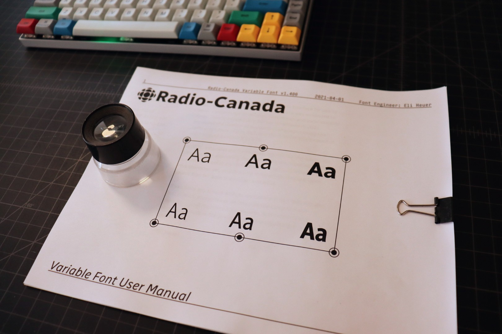

# Radio-Canada Typeface

The Canadian Broadcasting Corporation, or CBC/Radio-Canada, is a Canadian crown corporation that serves as the national public radio and television broadcaster.

In early 2017, work started on a custom typeface for use by CBC/Radio-Canada. In 2021 this typeface was expanded to cover a wider range of weights and now includes roman and italic variable fonts. Work on support for the [Unified Canadian Aboriginal Syllabics](https://en.wikipedia.org/wiki/Canadian_Aboriginal_syllabics) Unicode block is a possibility as this typeface continues to expand.

This project has been selected as a winner at the 2018 Communication Arts Typography competition in the Typeface Design category.

This typeface family is still under development, and will be coming soon to Google Fonts.

A 8.5x11 PDF user manual is avaiable [here](documentation/user-manual).

## Variable Font Axes

Radio-canada has the following axes:

Axis | Tag | Range | Default | Static Instances
--- | --- | --- | --- | ---
Weight | wght | 300 to 700 | 400 | Light, Regular, Medium, Semibold, Bold
Width | wdth | 75 to 100 | 100 | Condensed, SemiCondensed, Regular

#### `wght` (Weight) Axis

The `wght` axis spans Light (300) to Bold (700).

#### `wdth` (Width) Axis

The `wdth` axis spans Condensed (75) to Regular (700).

## Language Support

Acording to the [Hyperglot CLI tool](https://github.com/rosettatype/hyperglot), Radio-Canada currently supports 317 languages of Latin script:

Arbëreshë Albanian, Eastern Abnaki, Afar, Arvanitika Albanian, Western Abnaki, Achinese, Achuar-Shiwiar, Acheron, Eastern Arrernte, Afrikaans, Aguaruna, Gheg Albanian, Tosk Albanian, Amahuaca, Yanesha', Amis, Amarakaeri, Uab Meto, Aragonese, Mapudungun, Asu (Tanzania), Waorani, Anuta, Southern Aymara, Central Aymara, South Azerbaijani, North Azerbaijani, Bemba (Zambia), Bena (Tanzania), Bari, Bikol, Bini, Bislama, Bosnian, Breton, Garifuna, Kaqchikel, Catalan, Chachi, Chavacano, Cashibo-Cacataibo, Cashinahua, Candoshi-Shapra, Cebuano, Czech, Chiga, Chamorro, Ojitlán Chinantec, Chuukese, Cimbrian, Chokwe, Central Kurdish, Asháninka, Montenegrin, Cofán, Cornish, Corsican, Caquinte, Pichis Ashéninka, Crimean Tatar, Seselwa Creole French, Chiltepec Chinantec, Kashubian, Tedim Chin, Welsh, Danish, Taita, German, Andaandi, Dongolawi, Dehu, Dimli, Lower Sorbian, Jola-Fonyi, Embu, Standard Estonian, English, Ese Ejja, Basque, Faroese, Nobiin, Fijian, Filipino, Finnish, Kven Finnish, French, Western Frisian, Friulian, Gagauz, Borana-Arsi-Guji Oromo, West Central Oromo, Guadeloupean Creole French, Gilbertese, Scottish Gaelic, Irish, Galician, Manx, Gooniyandi, Ga’anda, Swiss German, Wayuu, Gusii, Gwichʼin, Eastern Oromo, Haitian, Hawaiian, Northern Qiandong Miao, Hiligaynon, Southern Qiandong Miao, Hani, Caribbean Hindustani, Hopi, Croatian, Upper Sorbian, Hungarian, Huastec, Iloko, Indonesian, Icelandic, Italian, Jamaican Creole English, Javanese, Shuar, Japanese, Kalaallisut, Kamba (Kenya), Makonde, Kabuverdianu, Kekchí, Kaingang, Khasi, Koyra Chiini Songhay, Kikuyu, Kinyarwanda, Kirmanjki, Kalenjin, Kimbundu, Northern Kurdish, Kongo, Konzo, Kaonde, Karelian, Shambala, Kölsch, Kituba (DRC), Kuanyama, Ladino, Latin, Ligurian, Lithuanian, Ladin, Lombard, Otuho, Lozi, Latgalian, Luxembourgish, Luba-Lulua, Ganda, Luo (Kenya and Tanzania), Standard Latvian, Matsés, Meru, Mauritian Creole, Makhuwa-Meetto, Minangkabau, Mískito, Malagasy, Maltese, Montagnais, Mohawk, Maori, Totontepec Mixe, Creek, Murrinh-Patha, Mirandese, Kala Lagaw Ya, Ixcatlán Mazatec, Naga Pidgin, Neapolitan, Navajo, South Ndebele, North Ndebele, Ndonga, Low German, Central Nahuatl, Niuean, Ao Naga, Dutch, Norwegian, Nomatsiguenga, Pedi, Nyanja, Nyankole, Occitan, Northwestern Ojibwa, Orma, Oroqen, Mezquital Otomi, Pampanga, Papiamento, Palauan, Páez, Picard, Pijin, Pintupi-Luritja, Paluan, Piemontese, Polish, Pohnpeian, Portuguese, Potawatomi, Upper Guinea Crioulo, Pipil, Ashéninka Perené, K'iche', Quechua, Cook Islands Māori, Romansh, Romanian, Rotokas, Rundi, Istro Romanian, Macedo-Romanian, Rwa, Sango, Samburu, Sangu (Tanzania), Sicilian, Sena, Seri, Koyraboro Senni Songhai, Secoya, Shipibo-Conibo, Pite Sami, Ume Sami, Shawnee, Slovak, Slovenian, Southern Sami, Northern Sami, Lule Sami, Inari Sami, Samoan, Shona, Soninke, Somali, Southern Sotho, Spanish, Sardinian, Saramaccan, Sranan Tongo, Swati, Sundanese, Maore Comorian, Congo Swahili, Swedish, Swahili, Silesian, Tahitian, Atayal, Tetun Dili, Teso, Tetum, Tagalog, Tiv, Tokelau, Tsakhur, Talysh, Toba, Tonga (Zambia), Tonga (Tonga Islands), Papantla Totonac, Tok Pisin, Tswana, Tsonga, Purepecha, Muslim Tat, Turkmen, Tumbuka, Turkish, Tasawaq, Tzeltal, Tzotzil, Meriam Mir, Umbundu, Munsee, Northern Uzbek, Venetian, Veps, Vietnamese, Makhuwa, Võro, Walser, Waray (Philippines), Warlpiri, Wik-Mungkan, Ho-Chunk, Walloon, Mwani, Wolof, Wiradjuri, Wangaaybuwan-Ngiyambaa, Xavánte, Xhosa, Kenzi, Mattokki, Soga, Yao, Yapese, Yindjibarndi, Makwe, Yucateco, Zapotec, Ngazidja Comorian, Malaysian, Záparo, Standard Malay, Zulu, Zuni

## License

Radio Canada fonts are licensed under the SIL Open Font License v1.1, a free software license that permits you to use the font software under a set of conditions. Please refer to the full text of the license for details about the permissions, conditions, and disclaimers.

See [OFL.txt](OFL.txt) for details.

## Installation Instructions
Font files are in the [fonts](fonts) directory, please follow the installation inscructions for your operating system of choice:

- [MacOS](https://support.apple.com/en-us/HT201749)
- [Windows](https://support.microsoft.com/en-us/help/314960/how-to-install-or-remove-a-font-in-windows)
- [Linux](https://wiki.archlinux.org/index.php/fonts#Manual_installation)

## Getting Involved
Would you like to contribute to the development of this font? Here is how **you** can help:

- Tell us about any bugs you find, or enhancements you would like to see on the Google Fonts issue tracker: [https://github.com/googlefonts/issues](https://github.com/googlefonts/issues)

- Contribute directly to the fonts. This repository contains a complete set of source files. Make changes and submit a pull request.
