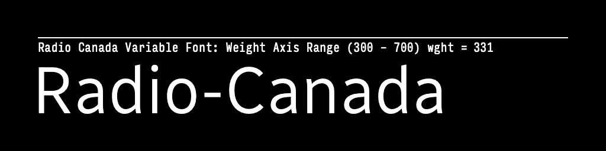
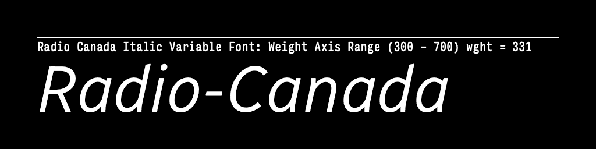
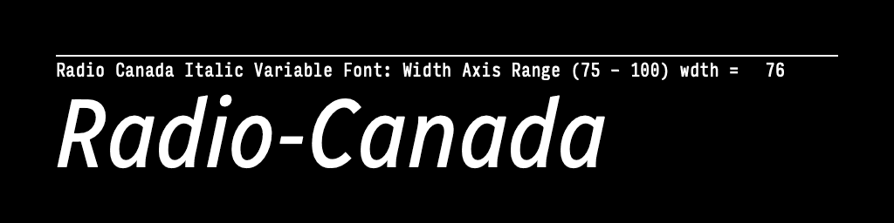

# Radio-Canada Typeface

The Canadian Broadcasting Corporation, or CBC/Radio-Canada, is a Canadian crown corporation that serves as the national public radio and television broadcaster.

In early 2017, work started on a custom typeface for use by CBC/Radio-Canada. In 2021 this typeface was expanded to cover a wider range of weights and now includes roman and italic variable fonts. Work on support for the [Unified Canadian Aboriginal Syllabics](https://en.wikipedia.org/wiki/Canadian_Aboriginal_syllabics) Unicode block is a possibility as this typeface continues to expand.

This project has been selected as a winner at the 2018 Communication Arts Typography competition in the Typeface Design category.

This typeface family is still under development, and will be coming soon to Google Fonts.

## Variable Font Axes

Radio-canada has the following axes:

Axis | Tag | Range | Default | Static Instances
--- | --- | --- | --- | ---
Weight | wght | 300 to 700 | 400 | Light, Regular, Medium, Semibold, Bold
Width | wdth | 75 to 100 | 100 | Condensed, SemiCondensed, Regular

#### `wght` (Weight) Axis

The `wght` axis spans Light (300) to Bold (700).

#### `wdth` (Width) Axis

The `wdth` axis spans Condensed (75) to Regular (700).

## License

Radio Canada fonts are licensed under the SIL Open Font License v1.1, a free software license that permits you to use the font software under a set of conditions. Please refer to the full text of the license for details about the permissions, conditions, and disclaimers.

See [OFL.txt](OFL.txt) for details.

## Installation Instructions
Font files are in the [fonts](fonts) directory, please follow the installation inscructions for your operating system of choice:

- [MacOS](https://support.apple.com/en-us/HT201749)
- [Windows](https://support.microsoft.com/en-us/help/314960/how-to-install-or-remove-a-font-in-windows)
- [Linux](https://wiki.archlinux.org/index.php/fonts#Manual_installation)

## Getting Involved
Would you like to contribute to the development of this font? Here is how **you** can help:

- Tell us about any bugs you find, or enhancements you would like to see on the Google Fonts issue tracker: [https://github.com/googlefonts/issues](https://github.com/googlefonts/issues)

- Contribute directly to the fonts. This repository contains a complete set of source files. Make changes and submit a pull request.
